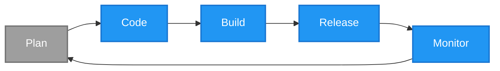

# Devsecops

The goal of the devsecops toolbox is to provide a set of open-source capabilities that enable secure software development and deployment practices.

> [!NOTE]
> Vulnerabilities are weaknesses or flaws in a system that can be exploited to breach the confidentiality, integrity, or availability of a system. Check out the [OWASP Top 10 common web application vulnerabilities](https://owasp.org/www-project-top-ten/) for examples.

Devsecops is the process of integrating automated security practices (and checks) within the software development lifecycle (SDLC). Conceptually, this means adding security checks that identify and mitigate against the introduction of vulnerabilities into a system.

## Principles

This toolbox is built around the following principles:

1. Open-Source - Using open-source tools increases transparency and accessibility because the source code is publicly available for use, inspection and contribution.
2. Usability - If a tool is hard to use, people find shortcuts which can introduce unforeseen vulnerabilities.
3. Automate - Everything that can be automated, should be automated to reduce human error and increase scalability.
4. Shift-Left - Security checks should not be implemented towards the end of the SDLC but rather when the potential vulnerabilities can be introduced.

## Software Development Lifecycle (SDLC)

> [!NOTE]
> The SDLC may consist of more phases than those illustrated in the diagram above, however, for the purposes of this toolbox, we will focus on these five core phases.

The software development lifecycle (SDLC) is a process used by development teams to design, develop, and maintain software applications. It typically consists of several phases including planning, coding, building, deploying, and monitoring.

Practically speaking, devsecops focuses on integrating automated security checks that identify vulnerabilities as early as possible in the software development lifecycle (SDLC) which is illsutrated in the diagram above.

### Plan

The planning phase is where the requirements for your system are defined and where threats are modelled (identified, assessed and mitigated, if necessary). This is a tricky phase to automate security checks for because it is human driven and very context specific.

The planning phase is out of the scope of this toolbox but I recommend running your planning through a threat-model specific LLM to get suggestions on potential threats and mitigations.

### Code

The coding stage is where the planning is realised with code implementations which can introduce vulnerabilities if secure coding practices are overlooked. Examples include:

- Injection flaws (e.g., SQL, NoSQL, OS, and LDAP injection)
- Misconfiguration (e.g., insecure default configurations, incomplete or ad hoc configurations)

> [!NOTE]
> Static code analysis can be performed manually but this is time-consuming which means it is also prone to human error and lacks scalability.

At this stage, you want to leverage static code analysis (SCA) which is also known as static application security testing (SAST). SCA is a fancy term for analysing source code for patterns that indicate potential security vulnerabilities. Common tools here include:

- [Trufflehog](https://github.com/trufflesecurity/trufflehog) - A tool for detecting secrets and sensitive information in code repositories.
- [Semgrep](https://semgrep.dev/) - A static analysis tool that scans code for security vulnerabilities and enforces coding standards.
- [Trivy](https://aquasecurity.github.io/trivy/) - A comprehensive security scanner for vulnerabilities in code, containers, and infrastructure as code (IaC) configurations.

Apart from SCA, this is also a good phase to ensure that the changes being introduced are well documented so that they can be traced effectively in the future. Common tools here include:

- [Conventional Commits](https://www.conventionalcommits.org/en/v1.0.0/) - A specification for adding human and machine-readable meaning to commit messages.
- [Commitlint](https://commitlint.js.org/#/) - A tool that checks if your commit messages meet the conventional commit format.
- [Husky](https://github.com/typicode/husky) - A tool that allows you to easily add Git hooks to your project, such as pre-commit hooks to run `trufflehog`, `semgrep`, `trivy`, `commitlint`, etc.

> [!TIP]
> This is also a good phase to test your changes however this is very dependent on the programming language that you are using. Do your research.

### Build

> [!NOTE]
> It can be argued that dependencies are introduced during the coding phase but I prefer to see them as part of the build phase because this is where 'external' code is pulled into the system, whether it is libraries, packages, or modules.

The build phase is where the code is compiled, dependencies are resolved, and artifacts are created. Common vulnerabilities include:

- Vulnerable dependencies (e.g., using libraries with known security issues)
- Vulnerable builds (e.g., insecure build configurations or processes)

Common tools here include:

- [Dependabot](https://dependabot.com/) - An automated tool that scans your dependencies for known vulnerabilities and creates pull requests to update them.
- [Trivy](https://aquasecurity.github.io/trivy/) - A comprehensive security scanner for vulnerabilities in code, containers, and infrastructure as code (IaC) configurations.

### Release

The release stage simply takes a compiled build artifact and deploys it to a target. Although this stage doesn't introduce new code or dependencies on its own, it plays an important part in ensuring that the recently built artefact is 'documented' so that anyone interacting with it in the future is aware of its underlying components and security posture.

### Monitor

> [!NOTE]
> The monitoring stage also encompasses the actual monitoring of the deployed artefacts however this is out of the scope of this toolbox because it depends on context-specific factors like the hosting environment and infrastructure to name a few.

A system can be built without vulnerabilities at one point in time (Monday) but new vulnerabilities can be discovered later (Wednesday) which is why built artefacts should not be considered 'safe' forever.

Monitoring involves continuously scanning deployed build artefacts for vulnerabilities, misconfigurations, and suspicious activities. Common tools here are the same as those listed in the [build section](#build) above. The only difference is that the scanning is performed on built artefacts rather than new changes that are being introduced to add features or fix bugs.
